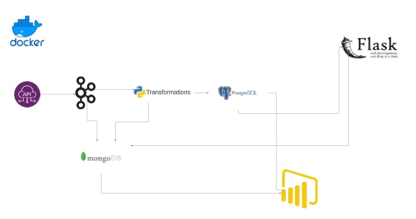

# Docker Compose Project for Stock Prediction

This project uses Docker Compose to set up a complete environment for Stock Prediction. It includes ZooKeeper, Kafka, producers, consumers, a Flask server, and a PostgreSQL database.

## Prerequisites

Before you begin, make sure you have the following prerequisites installed on your system:

- [Docker](https://www.docker.com/)
- [Docker Compose](https://docs.docker.com/compose/)

## Project Architecture



## Services

Here's a brief description of the services included in this project:

### ZooKeeper

ZooKeeper is used for distributed coordination and management. It plays a crucial role in maintaining configuration information, providing distributed synchronization, and more.

### Kafka

Kafka is a distributed streaming platform used for real-time data feeds. It serves as the central data pipeline for streaming data between producers and consumers.

### Producer

The producer service sends data to Kafka topics. It can be customized to generate and send data related to stock predictions to Kafka for processing.

### Consumer

The consumer service processes data from Kafka topics. It receives and analyzes data related to stock predictions, making it an essential component for real-time data processing.

### Flask Server

The Flask server provides an API for stock predictions. It serves as an interface for users and depends on Kafka for real-time data updates.

### PostgreSQL

PostgreSQL is used for storing historical stock data. It acts as a reliable and efficient database for managing and retrieving historical stock information.

## Usage

1. Clone this repository to your local machine:

   ```bash
   git clone https://github.com/your-username/stock-prediction-docker-compose.git
   cd stock-prediction-docker-compose
